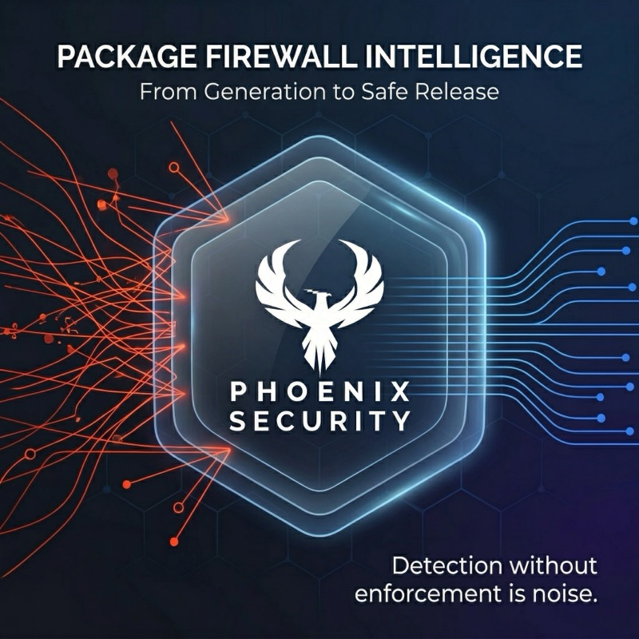

<p align="center">
  
</p>

<h1 align="center">Phoenix Supply Chain Firewall</h1>

<p align="center">
  <strong>Detection without enforcement is noise.</strong><br>
  Intelligence-driven package firewall for CI/CD pipelines.
</p>

<p align="center">
  <a href="https://github.com/Security-Phoenix-demo/phoenix-firewall/actions"></a>
  <a href="https://github.com/Security-Phoenix-demo/phoenix-firewall/releases"></a>
  <a href="LICENSE"></a>
  <a href="https://cvedetails.io"></a>
</p>

---

## What is this?

Phoenix Firewall is a **MITM proxy** that sits between your package manager (`npm`, `pip`, `yarn`, `pnpm`, `uv`, `poetry`) and the package registry. It evaluates every package install against Phoenix Security's [Malware Package Intelligence](https://cvedetails.io) — 52 heuristic rules, dual-LLM adversarial verification, and per-user policy rules — and **blocks malicious packages before they execute**.

```
Developer runs: npm ci
       ↓
Phoenix Firewall intercepts registry requests
       ↓
Checks each package against /api/v1/firewall/evaluate
       ↓
✅ Allow  → package installs normally
⚠️ Warn   → package installs with stderr warning
🚫 Block  → HTTP 403, npm fails with exit 1
🔒 Approval → HTTP 403, exit 78, Slack notification sent
```

## Quick Start

### Option 1: CI Mode (recommended)

```bash
# Download binary
curl -sfL https://github.com/Security-Phoenix-demo/phoenix-firewall/releases/latest/download/phoenix-firewall-linux-amd64 \
  -o /usr/local/bin/phoenix-firewall
chmod +x /usr/local/bin/phoenix-firewall

# Install PATH shims (wraps npm/pip/yarn/pnpm transparently)
eval $(phoenix-firewall --api-key $PHOENIX_API_KEY --ci)

# Now use package managers normally — they're protected
npm ci          # ← intercepted by Phoenix Firewall
pip install -r requirements.txt  # ← intercepted
```

### Option 2: Proxy Mode

```bash
# Start proxy on port 8443
phoenix-firewall --api-key $PHOENIX_API_KEY --port 8443 &

# Point package managers at the proxy
HTTPS_PROXY=https://localhost:8443 npm ci
```

### Option 3: GitHub Action

```yaml
- uses: Security-Phoenix-demo/firewall-action@v1
  with:
    api-key: ${{ secrets.PHOENIX_API_KEY }}
    mode: enforce
    fail-on: block
```

## Features

### Intelligence-Driven Detection

Phoenix Firewall doesn't just check a static blocklist. It evaluates packages against:

- **52 heuristic rules** across 7 categories (code, network, persistence, reconnaissance, metadata, CI/CD, runtime)
- **Dual-LLM analysis** — Gemini 2.5 Flash (analyst) + Claude Sonnet 4 (adversarial judge)
- **15+ ecosystem feeds** — OSSF, OSM, SafeChain covering npm, PyPI, Maven, NuGet, Cargo, Go, and more
- **Per-user policy rules** — 14 condition types, configurable actions, Slack notifications

### 14-Condition Rule Engine

Create rules based on any combination of:

| Condition | Example |
|-----------|---------|
| Ecosystem | `npm`, `pypi`, `maven`, `*` |
| Package pattern | `@scope/*`, `evil-.*` (glob/regex/exact) |
| MPI confidence | `>= 0.75` |
| MPI signals | `CS-001`, `NS-004`, `RS-001` |
| Threat type | `dropper`, `backdoor`, `worm` |
| PS-OSS score | `>= 80` |
| Compromise status | `active`, `recent_30d` |
| Package age | `<= 48 hours` (quarantine) |
| License category | `copyleft`, `restricted` |
| MITRE techniques | `T1195.002`, `T1059.004` |
| Maintainer age | `<= 30 days` |
| CI/CD signals | `CI-001`, `CI-002` |

### Action Precedence

When multiple rules match: **block > require_approval > warn > audit > allow**

| Action | Behavior | Exit Code |
|--------|----------|-----------|
| `block` | HTTP 403, install fails | 1 |
| `require_approval` | HTTP 403, Slack notification sent | 78 |
| `warn` | Install proceeds, stderr warning | 0 (unless `--fail-on warn`) |
| `audit` | Install proceeds, logged silently | 0 |
| `allow` | Install proceeds | 0 |

### 5 Default Templates

Activate with one click in the Phoenix dashboard:

1. **Block confirmed malware** — MPI confidence >= 75% + active compromise
2. **Quarantine new packages** — packages less than 48 hours old
3. **Block credential theft** — signals RS-001 or NS-004
4. **Block install hook abuse** — signal CS-002 + package < 7 days old
5. **Warn on high risk** — PS-OSS score >= 80

## Installation

### Pre-built Binaries

| Platform | Download |
|----------|----------|
| Linux (x86_64) | `phoenix-firewall-linux-amd64` |
| Linux (ARM64) | `phoenix-firewall-linux-arm64` |
| macOS (Intel) | `phoenix-firewall-darwin-amd64` |
| macOS (Apple Silicon) | `phoenix-firewall-darwin-arm64` |
| Windows (x86_64) | `phoenix-firewall-windows-amd64.exe` |

```bash
# Linux/macOS
curl -sfL https://github.com/Security-Phoenix-demo/phoenix-firewall/releases/latest/download/phoenix-firewall-$(uname -s | tr A-Z a-z)-$(uname -m | sed 's/x86_64/amd64/;s/aarch64/arm64/') \
  -o /usr/local/bin/phoenix-firewall
chmod +x /usr/local/bin/phoenix-firewall

# Verify
phoenix-firewall --version
```

### Build from Source

```bash
# Requires Rust 1.75+
cargo build --release
# Binary at: target/release/phoenix-firewall
```

## CLI Reference

```
phoenix-firewall [OPTIONS]

Options:
  --api-key <KEY>              Phoenix API key [env: PHOENIX_API_KEY]
  --api-url <URL>              Phoenix API URL [default: https://api.cvedetails.io]
  --ci                         CI mode: install PATH shims for transparent interception
  --strict                     Fail-closed when API unreachable (default: fail-open)
  --fallback-feed <PATH>       Local JSON feed for offline operation
  --report-path <PATH>         JSON report output [default: phoenix-firewall-report.json]
  --port <PORT>                Proxy listen port [default: 8443, 0=random]
  --mode <MODE>                enforce | warn | audit [default: enforce]
  --fail-on <LEVEL>            block | warn | any [default: block]
  --min-package-age-hours <N>  Quarantine threshold [default: 0]
  -v, --verbose                Verbose output
  -h, --help                   Print help
  -V, --version                Print version
```

## CI/CD Integration

### GitHub Actions

```yaml
name: Secure Build
on: [push, pull_request]

jobs:
  build:
    runs-on: ubuntu-latest
    steps:
      - uses: Security-Phoenix-demo/firewall-action@v1
        with:
          api-key: ${{ secrets.PHOENIX_API_KEY }}
          mode: enforce
          fail-on: block
          egress-policy: block  # Optional: Harden-Runner integration
          allowed-endpoints: |
            registry.npmjs.org:443
            pypi.org:443
            api.cvedetails.io:443

      - uses: actions/checkout@v4
      - run: npm ci  # Protected by Phoenix Firewall
```

### GitLab CI

```yaml
firewall-check:
  stage: test
  before_script:
    - curl -sfL https://github.com/Security-Phoenix-demo/phoenix-firewall/releases/latest/download/phoenix-firewall-linux-amd64 -o /usr/local/bin/phoenix-firewall
    - chmod +x /usr/local/bin/phoenix-firewall
    - eval $(phoenix-firewall --api-key $PHOENIX_API_KEY --ci)
  script:
    - npm ci  # Protected
```

### Jenkins

```groovy
stage('Install Dependencies') {
    steps {
        sh '''
            curl -sfL https://github.com/Security-Phoenix-demo/phoenix-firewall/releases/latest/download/phoenix-firewall-linux-amd64 -o /usr/local/bin/phoenix-firewall
            chmod +x /usr/local/bin/phoenix-firewall
            eval $(phoenix-firewall --api-key $PHOENIX_API_KEY --ci)
            npm ci
        '''
    }
}
```

## Offline / Air-Gapped Mode

```bash
# Download feed for offline use
curl -sf https://api.cvedetails.io/api/v1/firewall/feed/npm.json -o npm-feed.json

# Use with fallback feed
phoenix-firewall --api-key $KEY --fallback-feed npm-feed.json --ci
```

In `--fallback-feed` mode, the firewall blocks known-malicious packages from the local feed and allows everything else (fail-open). Add `--strict` to fail-closed.

## How It Works

### Architecture

```
┌─────────────────────────────────────────────────────────┐
│                    Developer Machine / CI Runner          │
│                                                           │
│  npm ci ──→ Phoenix Firewall (MITM Proxy) ──→ npm Registry
│              │                                            │
│              ├─ Intercept registry.npmjs.org requests     │
│              ├─ Extract package name + version from URL   │
│              ├─ POST /api/v1/firewall/evaluate            │
│              │   (user rules + MPI intelligence)          │
│              ├─ Cache result (LRU, 10K entries)           │
│              └─ Enforce: 403 (block) / 200 (allow)       │
│                                                           │
└─────────────────────────────────────────────────────────┘
                         │
                         ▼
┌─────────────────────────────────────────────────────────┐
│              Phoenix Security API (cvedetails.io)         │
│                                                           │
│  POST /api/v1/firewall/evaluate                          │
│   ├─ Load user's firewall rules (14 conditions)          │
│   ├─ Match against MPI intelligence (52 signals)         │
│   ├─ Resolve action: block > require_approval > warn     │
│   └─ Return verdict + matching rules + signals           │
│                                                           │
│  GET /api/v1/firewall/feed/{ecosystem}.json              │
│   └─ Safe Chain-compatible feed (OSSF + MPI + custom)    │
└─────────────────────────────────────────────────────────┘
```

### MITM Proxy

The firewall generates an **ephemeral root CA certificate** (valid 24 hours) and sets `HTTPS_PROXY`/`HTTP_PROXY` + `NODE_EXTRA_CA_CERTS`/`SSL_CERT_FILE` environment variables. This allows it to intercept TLS traffic to package registries without modifying the system trust store permanently.

### Supported Registries

| Registry | Ecosystems | URL Pattern |
|----------|-----------|-------------|
| registry.npmjs.org | npm, yarn, pnpm | `/@scope/pkg/-/pkg-ver.tgz` |
| registry.yarnpkg.com | yarn | Same as npm |
| pypi.org | pip, uv, poetry | `/simple/pkg/`, `/packages/.../file` |
| files.pythonhosted.org | pip, uv | `/packages/.../file.tar.gz` |

### Caching

The evaluate API client uses an **in-memory LRU cache** (10,000 entries) scoped to the current session. This means:
- First install of `lodash@4.17.21` → API call
- Transitive dependency also pulls `lodash@4.17.21` → cache hit (no API call)
- Typical npm project with 500 dependencies → ~200-300 API calls (rest cached)

## API

The firewall calls these Phoenix Security API endpoints:

| Endpoint | Method | Description |
|----------|--------|-------------|
| `/api/v1/firewall/evaluate` | POST | Rich per-user rule evaluation |
| `/api/v1/firewall/feed/{eco}.json` | GET | Safe Chain-compatible blocklist |
| `/api/v1/firewall/rules` | GET | List user's rules |
| `/api/v1/firewall/rules/templates` | GET | Default rule templates |

Get your API key at [cvedetails.io/admin](https://cvedetails.io/admin).

## Security

- **Apache 2.0** — clean-room implementation, no AGPL dependencies
- **Ephemeral CA** — 24-hour certificate, regenerated each session
- **No secrets logged** — API keys and package contents never appear in stderr/stdout
- **Fail-open default** — if the API is unreachable, installs proceed (use `--strict` for fail-closed)
- **SHA256 verification** — binary checksums published with every release

## Contributing

Contributions welcome! Please open an issue first to discuss the change.

```bash
# Development
cargo build
cargo test
cargo clippy
```

## License

Apache License 2.0 — Copyright 2026 Phoenix Security Ltd.

See [LICENSE](LICENSE) for the full text.

---

<p align="center">
  <a href="https://phoenix.security">Phoenix Security</a> · <a href="https://cvedetails.io">CVE Intelligence</a> · <a href="https://github.com/Security-Phoenix-demo/phoenix-firewall/issues">Report Bug</a>
</p>
